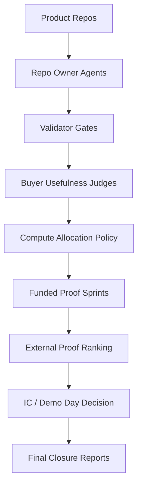

# Codex Demo Day Arena

> A product-foundry control plane for evaluating AI-built startup candidates through validator gates, buyer-usefulness scoring, compute allocation, and Demo Day-style investment decisions.

## Why I Built This

AI coding agents can generate code quickly, but speed alone creates noise. The harder problem is deciding which products deserve more compute.

Codex Demo Day Arena treats AI-built projects like a venture portfolio: agents build, validators reject weak maturity, buyer judges score usefulness, and compute is allocated only to products that clear explicit gates.

## What It Does

- Validates product repos against maturity gates.
- Detects weak product surfaces, thin architecture, poor evals, hidden mocks, and missing buyer artifacts.
- Scores products using buyer-usefulness rubrics.
- Allocates additional compute only to the strongest candidates.
- Supports pivots, but makes them evidence-gated and expensive.
- Prioritizes external proof once synthetic development stops being useful.
- Produces Demo Day-style final reports and investment decisions.

## Core Principle

More code is not progress.

More product evidence is progress.

## Technical Paper

Read the companion paper:

**[More Code Is Not Progress: Evidence-Gated Orchestration for AI Coding Agent Product Portfolios](paper/more-code-is-not-progress.md)**

The paper describes the arena as a control-plane implementation: repo discovery, validator inputs/outputs, maturity flags, buyer scoring, compute allocation, proof-priority ranking, candidate state transitions, and the no-winner decision rule.

Paper assets:

- [Paper index](paper/README.md)
- [BibTeX citation](paper/citation.bib)
- [Reproducibility note](docs/reproducibility.md)

## System Architecture



## Operating Loop

1. Repo-owner agents improve product candidates.
2. Validator gates check product maturity.
3. Buyer judges score usefulness from the target operator's perspective.
4. Compute allocation funds only the strongest candidates.
5. Funded proof sprints improve product surfaces, evals, receipts, and buyer artifacts.
6. External-proof ranking identifies which products need real customer evidence.
7. The final IC process decides whether any product deserves the fictional $10M check.

## Results

- 20 product repos assessed.
- 20/20 reached structural readiness.
- 0 validator flags remained.
- 19/20 became buyer-compelling but external-proof-required.
- 5 proof-now finalists identified.
- No $10M winner awarded because no candidate had enough external proof.

## Why No Winner?

The arena produced product-shaped, buyer-compelling candidates. But the final investment bar required external proof: real customer feedback, real data, pilot interest, or willingness-to-pay signals.

The system refused to manufacture conviction from synthetic validation alone. That is the point. A good agentic evaluation system has to know when to say no.

## Repository Map

```text
codex-demo-day-arena/
  README.md
  FINAL_DEMO_DAY_REPORT.md
  WHY_NO_WINNER.md
  PORTFOLIO_OUTCOME.md
  TOP_REPOS_TO_REVISIT.md
  LESSONS_LEARNED.md
  paper/
    more-code-is-not-progress.md
    figures/
    tables/
    references.md
  docs/
    architecture.md
    operating-model.md
    compute-allocation.md
    validation-system.md
    buyer-judging.md
    external-proof-phase.md
    limitations.md
  prompts/
    repo-owner-round1.md
    repo-owner-funded-proof.md
    investor-judge.md
    buyer-usefulness-judge.md
    investment-committee.md
  policies/
    PRODUCT_MATURITY_RUBRIC.md
    INVESTMENT_READINESS_GATE.md
    COMPUTE_ALLOCATION_POLICY.md
    PIVOT_POLICY.md
    EXTERNAL_PROOF_PROTOCOL.md
    PROOF_PRIORITY_RUBRIC.md
    STOPPING_RULES.md
  reference/
    TASTE_BANK_RUBRIC.md
    anti-patterns/
    exemplars/
  scripts/
    validate_product_repos.py
    tier_product_repos.py
    prepare_repo_round.py
    launch_repo_owners.py
    rank_external_proof.py
  examples/
    sample_validation_report.json
    sample_buyer_scorecard.md
    sample_compute_allocation.md
    sample_proof_priority_report.md
```

## Example Reports

The `examples/` directory contains sanitized examples of the control-plane outputs:

- validation report
- buyer scorecard
- compute allocation report
- proof-priority report

The actual product repos are private. This public repo is the orchestration and evaluation system.

## Final Status

The arena is closed.

- Active owner agents: none
- Active video producers: none
- Active judging agents: none
- Winner awarded: no
- Fictional $10M check: not awarded
- Normal development: frozen

The arena should be reopened only if a real customer, real data source, or real use case justifies reopening a specific repo.

## Reopening Rule

Do not reopen the arena globally.

Only reopen a specific repo if there is one of:

- real customer/user feedback,
- real or public input data,
- a buyer workflow validation opportunity,
- a willingness-to-pay or pilot signal,
- a sample-data request,
- a real use case that can produce an external proof packet.

If reopened, the repo must produce:

- `EXTERNAL_PROOF_PACKET.md`
- `CUSTOMER_FEEDBACK.md`
- `REAL_DATA_RECEIPT.md` when real or public data is used
- `UPDATED_IC_MEMO.md`
- `FUNDING_RECOMMENDATION.md`

Do not launch owner agents for local polish. Do not add product features before external proof creates a specific implementation gap.

## Branches And Commits Produced

### Control-Plane Commits

| Commit | Purpose |
| --- | --- |
| `f27b826` | Run funded round 2 owners |
| `385c3cb` | Run funded proof batch 2 orchestration |
| `3ed8c28` | Run funded proof batch 3 orchestration |
| `b9ebce2` | Run funded proof batch 4 orchestration |
| `590349e` | Run funded proof batch 5 orchestration |
| `2f016a3` | Run funded proof batch 6 orchestration |
| `57c4f78` | Run funded proof batch 7 orchestration |
| `e56e9cf` | Add external proof phase |
| `57826ac` | Close Demo Day arena |

### Product Repo Branches

The 20 product repos are private. Their branches were retained as private artifacts for future proof work.

## Limitations

This project tests orchestration, validation, and product judgment. It does not claim that synthetic evaluation proves venture-scale demand. The system intentionally stops when the next required signal must come from real users or real data.

## Future Work

The only future work that matters is external proof:

- run a proof-now finalist against a real target-user workflow,
- collect customer feedback,
- produce a real-data receipt,
- update the IC memo,
- decide whether reopening that specific repo is justified.

## License

MIT
