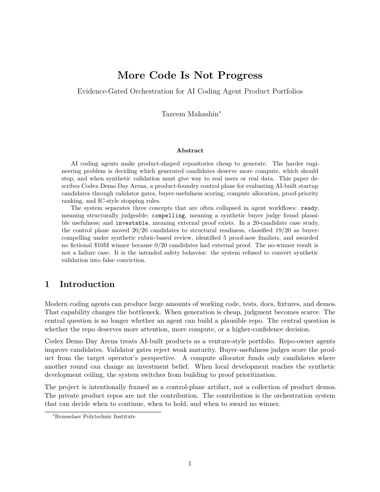
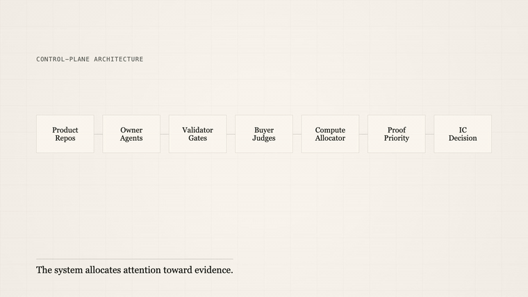
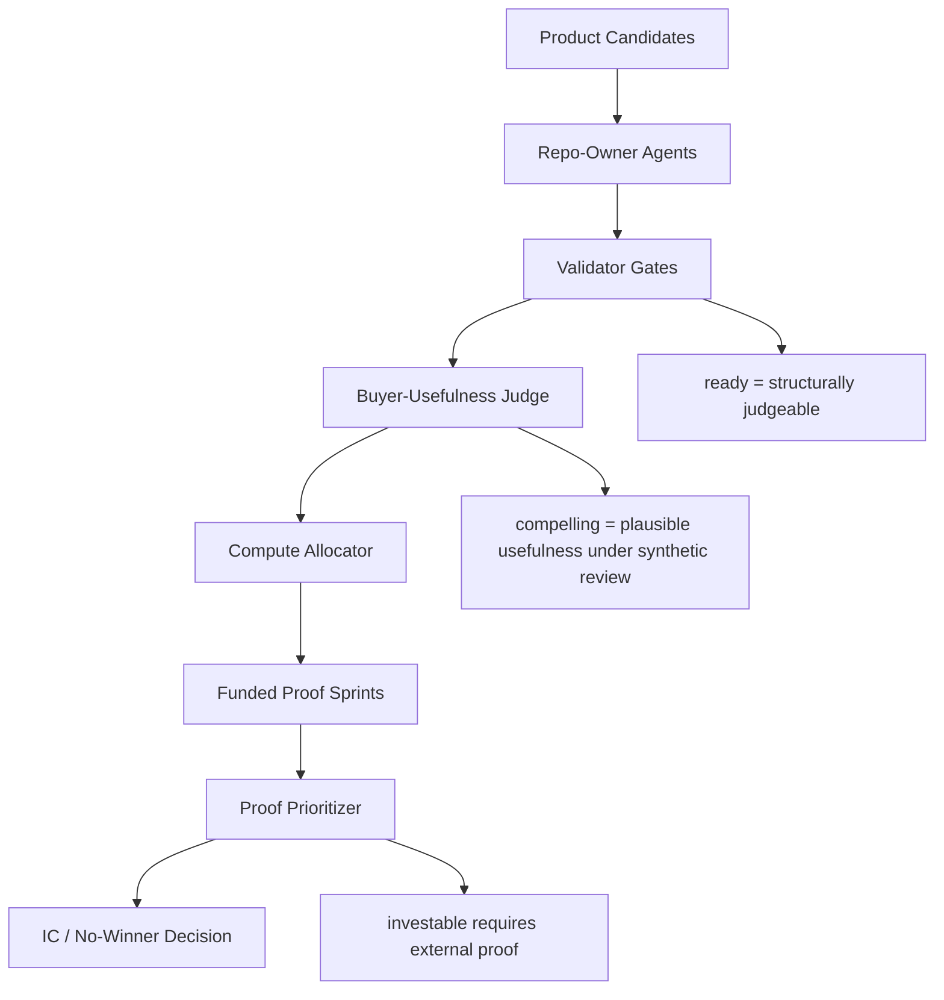

<h1 align="center">Codex Demo Day Arena</h1>

<p align="center">
  <strong>A product-foundry control plane for evaluating AI-built startup candidates through validator gates, buyer-usefulness scoring, compute allocation, and IC-style stopping rules.</strong>
</p>

<p align="center">
  
  
  
  
  
</p>

<p align="center">
  <a href="paper/more-code-is-not-progress.pdf">
    
  </a>
  <a href="https://youtu.be/n7-Aguvs-XA">
    
  </a>
</p>

<p align="center">
  <a href="paper/more-code-is-not-progress.pdf"><strong>Read the technical paper</strong></a>
  ·
  <a href="https://youtu.be/n7-Aguvs-XA">Watch the 2:45 systems walkthrough</a>
</p>

> **TL;DR:** Codex Demo Day Arena evaluated 20 AI-built product candidates through maturity validators, synthetic buyer-usefulness judges, compute-allocation policy, and external-proof gates. It moved 20/20 candidates to structural readiness and classified 19/20 as buyer-compelling under rubric-based review, but awarded no fictional $10M winner because 0/20 had external proof.

## Best Way To Review

1. Read the [paper PDF](paper/more-code-is-not-progress.pdf), especially the state machine and no-winner sections.
2. Scan the [Final Demo Day Report](FINAL_DEMO_DAY_REPORT.md) for the portfolio outcome.
3. Review [Why No Winner](WHY_NO_WINNER.md) to understand the investment-readiness bar.
4. Inspect the policy layer in [`policies/`](policies/) and sanitized outputs in [`examples/`](examples/).
5. Read [`docs/reproducibility.md`](docs/reproducibility.md) for the boundary between public control-plane artifacts and private product repos.

## Overview

AI coding agents can generate code quickly, but speed alone creates noise. The harder technical problem is deciding which candidates deserve more compute.

Codex Demo Day Arena treats AI-built products like a venture portfolio. Repo-owner agents build and improve candidates; validators reject weak product maturity; buyer judges score usefulness from the operator's perspective; a compute allocator funds only candidates that can change an investment belief; and an external-proof layer stops the system from mistaking synthetic polish for market evidence.

The project is intentionally not framed as "20 AI-generated startups." It is a repo-level orchestration system for agentic product evaluation, portfolio governance, and disciplined stopping.

## Core Result Snapshot

| Metric | Result | Interpretation |
| --- | ---: | --- |
| Product candidates assessed | 20 | Private product repos were evaluated by the control plane. |
| Structurally ready | 20/20 | Every candidate became judgeable under validator gates. |
| Validator flags remaining | 0 | Maturity validation was no longer the bottleneck. |
| Buyer-compelling under synthetic review | 19/20 | Rubric-based buyer judges found plausible usefulness, not market validation. |
| Proof-now finalists | 5 | Fastest candidates for real-world proof attempts. |
| Investment-grade proof | 0/20 | No candidate had real customer/data evidence. |
| Winner awarded | 0 | The system refused to manufacture conviction from synthetic validation. |

## Architecture



## Methodology

| Layer | Purpose | Output |
| --- | --- | --- |
| Repo-owner agents | Improve individual candidates within controlled rounds. | Product branches, demo surfaces, receipts, tests, evals. |
| Validator gates | Enforce structural maturity before judgment. | `ready`, `flags`, `warnings`, command results, LOC metrics, artifact checks. |
| Buyer-usefulness scoring | Ask whether a target operator would plausibly care. | Score, verdict, recommendation, strongest believe/pass reasons. |
| Compute allocation | Decide whether another owner round is worth funding. | `round-2-owner`, `external-proof-required`, `hold`, `salvage-or-pivot`. |
| Proof prioritization | Rank candidates by fastest path to real-world evidence. | Proof-now, proof-later, customer-data-required, synthetic-ceiling categories. |
| IC decision | Decide whether any candidate deserves the fictional $10M check. | Winner or no-winner outcome. |

## Technical Paper

The companion paper presents the system as an engineering artifact rather than a narrative postmortem:

- **Author:** Tazeem Mahashin, Rensselaer Polytechnic Institute
- [Paper PDF](paper/more-code-is-not-progress.pdf)
- [Markdown paper](paper/more-code-is-not-progress.md)
- [LaTeX source](paper/more-code-is-not-progress.tex)
- [BibTeX citation](paper/citation.bib)
- [Reproducibility note](docs/reproducibility.md)

Build the paper locally:

```bash
cd paper
make
```

The build uses `tectonic`.

## Key Design Principle

```text
Fund next round only if:
DeltaInvestmentBelief(next_round) > CostOfCompute + RiskOfFalseConfidence
```

Where:

- `DeltaInvestmentBelief` is the expected increase in confidence that a product deserves external validation or investment review.
- `CostOfCompute` is agent time, added complexity, and review burden.
- `RiskOfFalseConfidence` is the chance that synthetic polish makes the product look better without making it more real.

## Candidate States

| State | Meaning |
| --- | --- |
| `ready` | Structurally judgeable: demo, tests, evals, receipt, product surface, artifact, and mock disclosure exist. |
| `compelling` | Synthetic buyer judge found plausible usefulness under a rubric. |
| `external-proof-required` | Further local coding cannot resolve the main remaining uncertainty. |
| `proof-now` | Candidate has a fast path to real user/data validation. |
| `investable` | External proof exists and IC review can begin. |

## Repository Map

```text
paper/          LaTeX paper, PDF, Markdown version, figures, tables, citations
docs/           Architecture, operating model, validation, buyer judging, reproducibility
policies/       Maturity rubric, investment readiness gate, compute allocation, proof protocol
prompts/        Repo-owner, buyer judge, investor judge, and technical judge prompts
scripts/        Control-plane scripts for validation, judging, allocation, and proof ranking
examples/       Sanitized sample outputs; no private product repo data
reference/      Taste Bank rubric, exemplar profiles, and anti-patterns
```

## Quickstart

This public repo is the control-plane artifact. The evaluated product repos are private, so the main public workflows are inspection and paper build.

Run script syntax checks:

```bash
python3 -m py_compile scripts/*.py
```

Build the paper:

```bash
cd paper
make
```

Inspect sanitized output examples:

```bash
ls examples/
```

## Claim Boundaries

This project does **not** claim that the 20 candidates were market validated.

It claims:

- the control plane made candidates structurally judgeable,
- synthetic buyer judges classified 19/20 as plausibly useful,
- the allocator identified when local development hit a synthetic ceiling,
- no candidate received the fictional $10M check because external proof was missing.

The no-winner result is central. A weaker system would have selected the highest synthetic score. This one stopped.

## Final Status

The arena is closed.

- Active owner agents: none
- Active judging agents: none
- Winner awarded: no
- Fictional $10M check: not awarded
- Normal development: frozen

The arena should be reopened only if a real customer, real data source, or real use case justifies reopening a specific repo.

## Reopening Rule

Do not reopen the arena globally. Reopen a specific repo only with:

- real customer/user feedback,
- real or public input data,
- a buyer workflow validation opportunity,
- a willingness-to-pay or pilot signal,
- a sample-data request,
- a real use case that can produce an external proof packet.

## License

MIT
