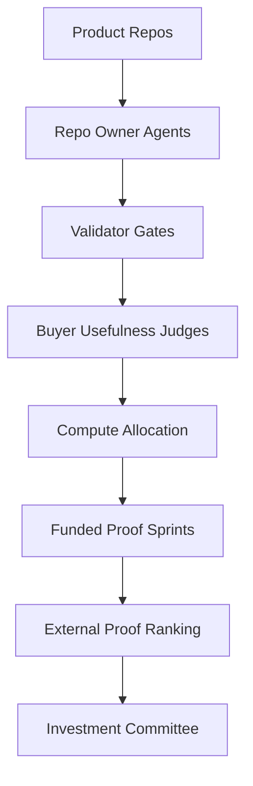

# Architecture

Codex Demo Day Arena is a control plane for managing AI coding agents across a portfolio of startup product candidates.

## Core Components

- Product repos: candidate startup products with runnable demos, tests, evals, and receipts.
- Repo-owner agents: Codex agents responsible for improving a single candidate.
- Validator gates: deterministic checks for maturity, product surface, artifacts, mocks, and evals.
- Buyer judges: usefulness review from the target operator's perspective.
- Compute allocator: portfolio policy that funds only the strongest candidates.
- External proof ranking: feasibility scoring for real customer/data validation.
- IC decision: final funding rule that can award no winner.

## Design Choice

The system separates productivity from investability. A repo can add code, tests, and reports without becoming more fundable. The control plane rewards evidence that changes an investment decision.
