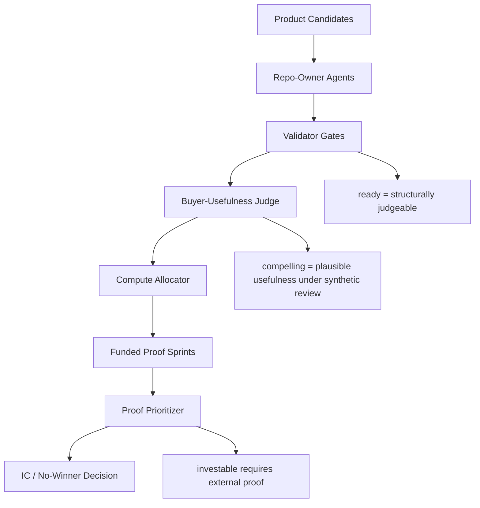
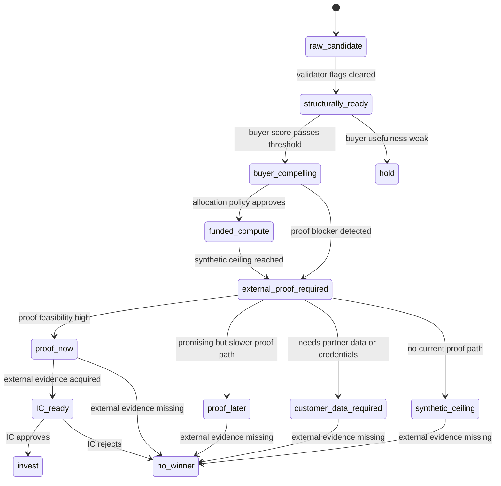

# More Code Is Not Progress: Evidence-Gated Orchestration for AI Coding Agent Product Portfolios

Tazeem Mahashin, Rensselaer Polytechnic Institute

## Abstract

AI coding agents make product-shaped repositories cheap to generate. The harder engineering problem is deciding which generated candidates deserve more compute, which should stop, and when synthetic validation must give way to real users or real data. This paper describes Codex Demo Day Arena, a product-foundry control plane for evaluating AI-built startup candidates through validator gates, buyer-usefulness scoring, compute allocation, proof-priority ranking, and IC-style stopping rules.

The system separates three concepts that are often collapsed in agent workflows: `ready`, meaning structurally judgeable; `compelling`, meaning a synthetic buyer judge found plausible usefulness; and `investable`, meaning external proof exists. In a 20-candidate case study, the control plane moved 20/20 candidates to structural readiness, classified 19/20 as buyer-compelling under synthetic rubric-based review, identified 5 proof-now finalists, and awarded no fictional $10M winner because 0/20 candidates had external proof. The no-winner result is not a failure case. It is the intended safety behavior: the system refused to convert synthetic validation into false conviction.

## 1. Introduction

Modern coding agents can produce large amounts of working code, tests, docs, fixtures, and demos. That capability changes the bottleneck. When generation is cheap, judgment becomes scarce. The central question is no longer whether an agent can build a plausible repo. The central question is whether the repo deserves more attention, more compute, or a higher-confidence decision.

Codex Demo Day Arena treats AI-built products as a venture-style portfolio. Repo-owner agents improve candidates. Validator gates reject weak maturity. Buyer-usefulness judges score the product from the target operator's perspective. A compute allocator funds only candidates where another round can change an investment belief. When local development reaches the synthetic development ceiling, the system switches from building to proof prioritization.

Prior software-engineering agent work has emphasized real repository tasks and agent-computer interfaces [1, 2]. This paper shifts the unit of analysis from resolving one issue or completing one task to governing a portfolio of product candidates.

The project is intentionally framed as a control-plane artifact, not a collection of product demos. The private product repos are not the contribution. The contribution is the orchestration system that can decide when to continue, when to hold, and when to award no winner.

## 2. Problem: Code Generation vs Product Evidence

AI coding agents often optimize for visible progress: more LOC, more files, more tests, more generated reports, and more narrative polish. In product work, those signals can be misleading. A repo can become larger and more internally coherent while failing to cross the threshold that matters: a target user understands the output and wants it.

The arena therefore distinguishes three levels of evidence:

| Level | Meaning | Typical evidence |
| --- | --- | --- |
| `ready` | Structurally judgeable. | Demo, tests, evals, receipt, product surface, buyer artifact, mock disclosure. |
| `compelling` | Plausibly useful under synthetic buyer review. | Buyer scorecard with useful artifact, strongest believe/pass reasons, and recommendation. |
| `investable` | External proof exists. | Real user feedback, real/public data, pilot request, sample-data request, or willingness-to-pay signal. |

This distinction prevents a common failure mode: treating a runnable, polished synthetic demo as a market-validated product. In this system, ready is not fundable. Compelling is not fundable. Only external proof can move a candidate toward investability.

## 3. System Overview

The arena is organized as a product-foundry control plane. Each product candidate lives as a repository with a standard command contract and maturity artifacts. The control plane executes a sequence of checks and allocation decisions over the portfolio.



The main components are:

- Product candidates: private repos containing candidate startup products.
- Repo-owner agents: AI coding agents assigned to improve a candidate.
- Validator gates: deterministic checks for maturity, artifacts, and command behavior.
- Buyer-usefulness judges: rubric-based reviews of whether the product output would matter to a target operator.
- Compute allocator: policy layer that decides whether another owner round is justified.
- Proof prioritizer: ranking system for deciding which candidates deserve external proof attempts.
- IC/no-winner decision: final rule that can award no check.

The architecture is compatible with the broader line of work on LLM agents acting in external environments [3, 6], but it adds an explicit portfolio-governance layer: candidate state, compute allocation, proof priority, and no-winner stopping.

## 4. Control-Plane Implementation

The implementation uses a script-driven control plane around private product repositories and a public sanitized artifact. Product repos are discovered from a manifest and processed by orchestration scripts. Each repo is expected to satisfy a standard interface:

```bash
make demo
make test
make eval
make receipt
```

The control flow can be summarized as:

```python
for repo in product_repos:
    validation = validate(repo)
    buyer_score = judge_buyer_usefulness(repo)
    proof_status = detect_external_proof_blocker(repo)
    allocation = allocate_compute(validation, buyer_score, proof_status)
```

### Repo Discovery And Round Workflow

The control plane discovers product repos from a manifest rather than hard-coding paths. A compatible manifest row contains a team id, product name, track, repository name, repository URL, and local checkout path. The private arena used that manifest to map portfolio-level policy decisions back to concrete repos without embedding product-specific logic in the validator or allocator.

A selected round writes owner briefs, launches repo-owner agents where appropriate, validates the updated repos, then writes portfolio-level reports. Later rounds use the previous round's validator and buyer outputs as inputs. Product branches are treated as round artifacts: each funded sprint can produce a branch and commit in the private product repo, while the public control-plane repo records only sanitized aggregate outputs and policy artifacts.

The workflow is round-based rather than infinite. That design is important: a candidate must periodically face portfolio review instead of continuing to accumulate code by default.

The public implementation is organized around small scripts:

| Script | Role |
| --- | --- |
| `product_repos.py` | Loads product repo metadata and exposes selection helpers. |
| `validate_product_repos.py` | Runs maturity checks and emits repo status rows. |
| `run_buyer_judges.py` | Builds buyer packets and parses buyer-usefulness scorecards. |
| `allocate_compute.py` | Joins validator and buyer outputs into portfolio actions. |
| `rank_external_proof.py` | Scores proof feasibility once synthetic development reaches its ceiling. |
| `prepare_repo_round.py` | Writes round briefs for selected repos. |
| `launch_repo_owners.py` | Launches owner agents for approved repos and captures logs. |

### Validator Inputs And Outputs

The validator consumes a product repo and emits a machine-readable status row. The important fields are:

- `ready`: whether the repo is structurally judgeable.
- `flags`: hard maturity issues.
- `warnings`: non-blocking quality concerns.
- command results: pass/fail and output tail for `demo`, `test`, `eval`, and `receipt`.
- LOC metrics: logic LOC, test/eval LOC, file counts.
- product-surface signals: source files and generated HTML/workspace artifacts.
- receipt artifacts: buyer-relevant generated outputs.
- investment-readiness terms: customer, pain, wedge, product surface, core output, aha, differentiation, technical depth, evaluation, receipt.

The validator does not identify winners. It enforces the minimum bar for being judged.

### Buyer Scoring Schema

The buyer-usefulness judge consumes a buyer packet derived from validator outputs, product artifacts, and maturity documents. It emits:

- numeric score,
- verdict,
- recommendation,
- answer to whether the target buyer would care,
- strongest reason to believe,
- strongest reason to pass,
- useful product output,
- demo-theater critique,
- required condition for more compute.

The important language is synthetic: a repo can be buyer-compelling under rubric-based review without being validated by a real buyer.

### Compute Allocation Decision Logic

The allocator joins validator status, buyer score, and external-proof blocker detection. It can assign four actions:

| Action | Meaning |
| --- | --- |
| `round-2-owner` | Fund another owner sprint because the next round can change an investment belief. |
| `external-proof-required` | Freeze normal coding because the next belief requires real data or users. |
| `hold` | Structurally ready but not buyer-compelling enough for more compute. |
| `salvage-or-pivot` | Validator is not green, so normal owner compute is blocked. |

The policy is intentionally conservative. Another sprint is justified only if:

```text
Fund next round only if:
DeltaInvestmentBelief(next_round) > CostOfCompute + RiskOfFalseConfidence
```

Where:

- `DeltaInvestmentBelief` is the expected increase in confidence that the product deserves external validation or investment review.
- `CostOfCompute` is agent time, additional complexity, and review burden.
- `RiskOfFalseConfidence` is the chance that synthetic polish makes the product look better without making it more real.

### Proof-Priority Ranking Algorithm

When the portfolio reaches the synthetic ceiling, the control plane ranks external-proof feasibility rather than product polish:

```text
proof_priority =
  buyer pain
  + reachable customer access
  + available real/sample data
  + demo clarity
  + willingness-to-pay signal
  - integration complexity
  - compliance/data sensitivity
```

The output categories are:

- `proof-now finalists`
- `proof-later contenders`
- `customer-data-required`
- `synthetic-ceiling-reached`

This ranking is not a funding decision. It answers a narrower question: which candidates can most quickly survive contact with reality?

### Public Artifact Packaging

The evaluated product repos remain private. The public repository includes the control-plane implementation, policies, prompts, sanitized examples, and aggregate reports. This prevents the public artifact from depending on private product details while preserving the engineering structure of the system.

## 5. Candidate State Machine

The system can be modeled as a state machine:



The state machine matters because it turns "stop developing" into an operational condition. Candidates do not stop because they are finished. They stop because the next unresolved uncertainty cannot be answered by local coding.

## 6. Validator And Maturity Gates

The validator checks whether a repo is structurally judgeable. It is deliberately not an investment committee. Passing means the candidate can be assessed, not that it should receive funding. The emphasis on multiple evidence dimensions follows the spirit of holistic evaluation: one metric is not enough when capability, reliability, transparency, and risk all matter [5].

Core gate requirements include:

| Gate | Required evidence | Meaning |
| --- | --- | --- |
| Runnable demo | `make demo` succeeds and produces product artifacts. | The product can show its core workflow. |
| Test/eval harness | `make test` and `make eval` succeed. | The repo has repeatable verification. |
| Receipt | `make receipt` writes a buyer-relevant evidence receipt. | The output can be audited. |
| Product surface | UI, workspace, dashboard, CLI workflow, or artifact viewer exists. | A user can interact with the product, not only a module. |
| Buyer artifact | Memo, packet, report, plan, workspace, or decision output exists. | The product produces something a target user could use. |
| Mock disclosure | Mocks, fixtures, and assumptions are documented. | The repo does not hide synthetic evidence. |
| Investment readiness | Customer, pain, wedge, aha, differentiation, evaluation, and receipt are answered. | The repo is judgeable as a startup candidate. |

The 20/20 readiness result is therefore not suspicious. The validator was not designed to select winners. It was designed to bring candidates to a minimum maturity bar so they could be judged consistently.

## 7. Buyer-Usefulness Scoring

Buyer-usefulness scoring asks whether a target operator would care about the output. The judge does not reward generic dashboards or large codebases by default. It looks for a painful workflow, a clear artifact, and a plausible reason the output would save time, improve judgment, reduce risk, or change a decision.

The scorecard includes:

- score,
- verdict,
- recommendation,
- whether the target buyer would care,
- strongest reason to believe,
- strongest reason to pass,
- useful product output,
- demo-theater critique,
- condition for more compute.

The buyer judge is synthetic. That limitation is central to the system. LLM-as-judge methods can approximate some preference judgments, but they carry known biases and cannot replace human or market evidence [4]. The correct claim is that 19 candidates were classified as buyer-compelling under synthetic rubric-based review. The paper does not claim that 19 products were market validated.

## 8. Compute Allocation And Stopping Rules

Compute allocation is where the arena becomes a portfolio system rather than a build loop. A repo can only receive another owner round when the next sprint can change a specific investment belief.

The allocator denies normal compute in three common cases:

- the validator is not green,
- the buyer judge does not find the product compelling,
- the next unresolved belief requires external proof.

This prevents the agentic equivalent of sunk-cost product management. More agent work is not automatically valuable. In fact, after a certain point, more synthetic work can increase confidence in the wrong thing: polish, not truth.

## 9. Synthetic Development Ceiling

The synthetic development ceiling is the point where further local coding cannot resolve the main remaining uncertainty.

Operationally, the ceiling is reached when:

- the product has a runnable surface,
- the core demo works,
- tests/evals/receipt exist,
- buyer artifacts are generated,
- the synthetic buyer judge finds plausible usefulness,
- the strongest remaining pass reason is real-world evidence.

At that point, another owner sprint is likely to create fake certainty. The only useful next signal is external: a target user, real/public data, sample-file request, pilot interest, or willingness-to-pay evidence.

In the final arena state, 19 buyer-compelling candidates were all classified as `external-proof-required`. That is the clearest evidence that the validator was no longer the bottleneck.

## 10. Case Study: 20-Repo Portfolio

The case study evaluated 20 product candidates across four broad tracks:

- finance,
- education,
- startup formation,
- enterprise agents.

Each candidate was developed through multiple rounds of repo-owner work, maturity validation, buyer-usefulness scoring, and compute allocation. The private repos contain the product implementations. The public repository contains the control-plane architecture, policies, scripts, prompts, sanitized examples, and aggregate reports.

The paper intentionally keeps product names secondary. The system contribution is not a specific generated startup. It is the control plane for managing a portfolio of AI-built candidates.

## 11. Results

Portfolio summary:

| Measure | Result | Interpretation |
| --- | ---: | --- |
| Product candidates assessed | 20 | Private product repos were evaluated by the control plane. |
| Structurally ready | 20 | All candidates became judgeable under validator gates. |
| Validator flags remaining | 0 | The maturity validator was no longer the bottleneck. |
| Buyer-compelling under synthetic review | 19 | Synthetic buyer rubric found plausible usefulness, not market validation. |
| Held as commercially weak | 1 | Structurally ready but not buyer-compelling. |
| Proof-now finalists | 5 | Fastest candidates for real-world proof attempts. |
| Investment-grade proof | 0 | No candidate had external proof. |
| Winner awarded | 0 | No fictional $10M check was awarded. |

Proof-priority categories:

| Category | Count | Meaning |
| --- | ---: | --- |
| Proof-now finalists | 5 | Fastest candidates for real-world proof attempts. |
| Proof-later contenders | 6 | Promising but slower proof paths. |
| Customer-data-required | 8 | Cannot advance without partner/customer data. |
| Synthetic-ceiling-reached | 1 | No current independent proof path. |

Top proof-now finalists:

| Candidate | Proof condition required to reopen |
| --- | --- |
| CanonKit | A real founder provides launch notes, proof claims, and draft positioning, then judges whether the launch pack is usable. |
| Wedgewise | A founder provides 3-5 real or anonymized customer interviews and judges whether the ICP memo changes positioning or discovery. |
| ProofPulse | A founder provides a real investor-update draft plus receipts and judges whether the output is sendable with light edits. |
| PrepPilot | A tutor provides an anonymized worksheet, missed questions, or session notes and marks what they would keep, rewrite, or discard. |
| SignalDraft | A finance operator reviews a memo generated from a real public earnings event and says whether it would save time or improve judgment. |

## 12. Why No Winner Was Awarded

The arena was designed to prevent synthetic validation from becoming false conviction. Once candidates reached structural readiness and buyer-compelling status, the remaining uncertainty required external proof. Since no candidate cleared that bar, the correct output was no winner.

This outcome demonstrates discipline. A weaker system would have selected the highest-scoring synthetic candidate and called it the winner. This system refused to award the fictional $10M check without real-world evidence.

The no-winner decision also clarifies the role of local AI coding agents. They can create product-shaped candidates and make them judgeable. They cannot, by themselves, prove customer urgency, willingness to pay, workflow adoption, or trust on real data.

## 13. Failure Modes

The arena exposed recurring failure modes:

| Failure mode | Symptom | Control-plane response |
| --- | --- | --- |
| Engineering mass without fundability | More LOC, tests, and packets without a clearer buyer-facing workflow. | Buyer judge and allocator withhold normal compute. |
| Missing product surface | Product is a module, script, or report generator only. | Validator flags missing surface or weak receipt artifact. |
| Fake product surface | UI exists but does not support a real operator workflow. | Buyer judge marks output as demo theater. |
| Synthetic eval overconfidence | Fixtures make the repo look correct without testing real data. | External-proof requirement blocks investment decision. |
| Narrative polish replacing evidence | Strong README or memo with weak runnable behavior. | Validator requires demo, eval, receipt, and generated artifacts. |
| Infinite owner loops | Agents keep finding one more feature to add. | Compute allocation requires expected investment-belief delta. |

These failure modes are not unique to this arena. They are likely to appear in any workflow where autonomous agents can continue adding plausible implementation detail without external reality checks.

## 14. Limitations

This is a systems case study, not a broad benchmark. The 20 candidate repos are private, which limits reproducibility of candidate-level results. The public repository contains the control-plane implementation and sanitized examples, not the full product portfolio.

The buyer judges are synthetic and rubric-based. They can identify plausible usefulness, surface demo theater, and compare artifacts, but they cannot prove demand. No real customer validation was performed in the final state. Therefore, the system's strongest conclusion is negative: none of the candidates should receive the fictional $10M investment without external proof.

The proof-priority ranking is also a policy heuristic rather than a statistical model. It is useful because it forces explicit tradeoffs: buyer pain, reachable access, data availability, demo clarity, willingness-to-pay signal, integration complexity, and compliance sensitivity.

## 15. Conclusion

Codex Demo Day Arena shows that agentic product development needs governance, not just generation. A product-foundry control plane can make candidates structurally judgeable, score synthetic buyer usefulness, allocate compute, detect the synthetic development ceiling, and stop before false conviction.

The final result is intentionally conservative: 20/20 ready, 19/20 compelling, 0/20 investable, and no winner. More code is not progress. Better evidence is progress.

## References

[1] Carlos E. Jimenez, John Yang, Alexander Wettig, Shunyu Yao, Kexin Pei, Ofir Press, and Karthik Narasimhan. "SWE-bench: Can Language Models Resolve Real-World GitHub Issues?" ICLR, 2024. <https://arxiv.org/abs/2310.06770>

[2] John Yang, Carlos E. Jimenez, Alexander Wettig, Kilian Lieret, Shunyu Yao, Karthik Narasimhan, and Ofir Press. "SWE-agent: Agent-Computer Interfaces Enable Automated Software Engineering." arXiv:2405.15793, 2024. <https://arxiv.org/abs/2405.15793>

[3] Xiao Liu et al. "AgentBench: Evaluating LLMs as Agents." ICLR, 2024. <https://arxiv.org/abs/2308.03688>

[4] Lianmin Zheng et al. "Judging LLM-as-a-Judge with MT-Bench and Chatbot Arena." NeurIPS Datasets and Benchmarks Track, 2023. <https://arxiv.org/abs/2306.05685>

[5] Percy Liang et al. "Holistic Evaluation of Language Models." arXiv:2211.09110, 2022. <https://arxiv.org/abs/2211.09110>

[6] Shunyu Yao, Jeffrey Zhao, Dian Yu, Nan Du, Izhak Shafran, Karthik Narasimhan, and Yuan Cao. "ReAct: Synergizing Reasoning and Acting in Language Models." ICLR, 2023. <https://arxiv.org/abs/2210.03629>
